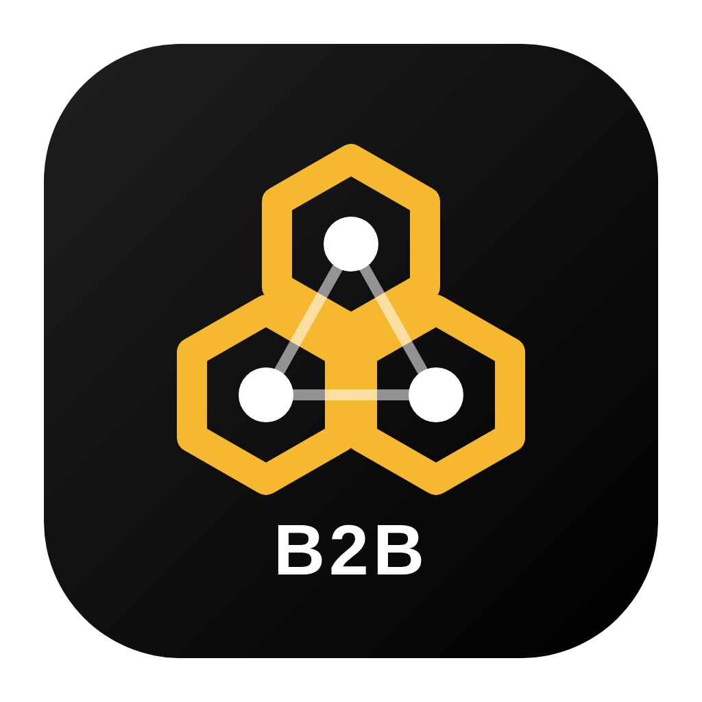
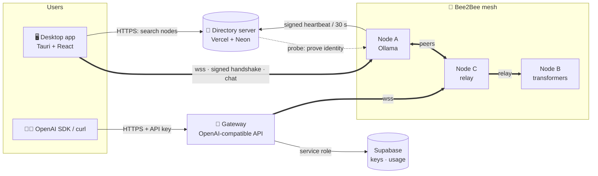

<div align="center">



# 🐝 Bee2Bee

**A peer-to-peer network for serving open AI models, plus a desktop control center to chat with any node, explore the mesh and deploy your own.**

[](pyproject.toml)
[](desktop/)
[](server/)
[](docs/PROTOCOL.md)
[](https://pypi.org/project/bee2bee/)
[](LICENSE)

[Features](#-features) · [Screenshots](#-screenshots) · [Quick start](#-quick-start) · [Architecture](#-architecture) · [Desktop app](#-desktop-app) · [Node CLI](#-node-cli) · [APIs](#-apis) · [Security](#-security-model) · [Deploy](#-deployment) · [Develop](#-development) · [FAQ](#-faq)

</div>

---

## ✨ What is Bee2Bee?

Bee2Bee turns spare GPUs into a shared, open inference network.

- **Anyone can run a node** that serves a model: a local [Ollama](https://ollama.com) model, a Hugging Face model running on your own hardware, or the Hugging Face Inference API.
- **Anyone can use the network**: the **desktop app** finds nodes through a central **directory**, verifies each node's cryptographic identity, and chats with it directly. Developers can also go through the **gateway**, which exposes the mesh as an **OpenAI-compatible API**.
- **Nodes talk to each other** over authenticated WebSockets. They discover peers, relay requests to whoever serves a model, and fail over when a node drops.

> **Heads-up about privacy:** the node that answers you can read your prompt. That is inherent to a volunteer network. Don't send passwords, personal or confidential data.

---

## 🚀 Features

<table>
<tr>
<td width="50%" valign="top">

### 🖥️ Desktop control center
- ChatGPT-style chat with **any node**: from the directory, your own deployments, or any `ws://`/`wss://` address
- Streaming answers, stop, regenerate, copy, markdown and code highlighting
- **Provenance** on every answer: which node, backend, tokens, tokens/s, latency
- **Explore network**: search and filter by model, provider, region, status and minimum speed; sort by speed, latency or uptime
- **Deploy nodes** on your machine with live logs, auto-start and status
- **Models**: pull, list and delete Ollama models with progress, and serve one with a click
- Light and dark themes; chats stay on your computer

</td>
<td width="50%" valign="top">

### 🌐 Mesh and infrastructure
- **Ed25519 identities**: a `peer_id` is derived from the public key and proven with a mutual challenge/response on every connection
- **Resilient routing**: provider ranking (price, reputation, latency), failover before the first token, cancellation, hop-limited relays
- **Self-healing**: reconnect with exponential backoff, dead-peer eviction, peer discovery
- **Directory server** on Vercel + Neon: signed heartbeats, reachability probes, uptime, search API
- **OpenAI-compatible API** on every node and on the gateway
- **Operable**: `/healthz`, `/readyz`, Prometheus `/metrics`, JSON logs, Docker images, CI/CD, load tests

</td>
</tr>
</table>

---

## 📸 Screenshots

Captured from the real desktop app on Linux, connected to a directory server and live nodes.


| Chat (dark theme) | Node details | Deploy nodes |
|:---:|:---:|:---:|
|  |  |  |

---

## ⚡ Quick start

### 1️⃣ Use the network: install the desktop app

Download the installer for your platform from the **[Releases](../../releases)** page:

| Platform | Package |
|---|---|
| Windows | `.msi` or `.exe` |
| macOS (Apple Silicon and Intel) | `.dmg` |
| Linux | `.deb`, `.rpm` or `.AppImage` |

Open it, go to **Settings → Directory server**, enter your directory URL, then **Explore network → pick a node → Chat**.

<details>
<summary>Run the desktop app from source</summary>

```bash
# Linux only: system libraries for the webview
sudo apt-get install -y libwebkit2gtk-4.1-dev libgtk-3-dev libayatana-appindicator3-dev librsvg2-dev libsoup-3.0-dev

cd desktop
npm ci
npm run tauri dev
```
Requires Node.js 20+ and a stable Rust toolchain.
</details>

### 2️⃣ Share your GPU: run a node

```bash
# Version 4.x speaks protocol v2. Until it is published on PyPI, install from a clone:
pip install .                      # Ollama and Hugging Face Inference API backends
pip install ".[hf,torch]"          # add local transformers models

ollama pull llama3.2
bee2bee serve-ollama --model llama3.2 --name "cairo-gpu" --region egypt \
  --public-host node.example.com
```

To appear in the directory, point the node at it:

```bash
export BEE2BEE_DIRECTORY_URL=https://your-directory.vercel.app
```

Or do it all from the desktop app: **Models → Pull → Serve**, or **Deploy nodes → New deployment**.

### 3️⃣ Run the backend locally

```bash
docker compose up --build          # a demo node + the gateway API on http://localhost:3001
```

---

## 🏗️ Architecture



| Component | Folder | Tech | Role |
|---|---|---|---|
| **Node** | [`bee2bee/`](bee2bee/) | Python 3.10+, asyncio, websockets, FastAPI | Serves models, routes and relays requests, local HTTP API |
| **Desktop app** | [`desktop/`](desktop/) | Tauri 2, React 18, TypeScript, Tailwind v4, Rust | Chat, explore, deploy, models, control center |
| **Directory server** | [`server/`](server/) | Vercel Functions, Neon Postgres, TypeScript | Lists online nodes, search/filter, uptime, stats |
| **Gateway** | [`gateway/`](gateway/) | Node.js 22, Express 5, ws | OpenAI-compatible API, API keys, quotas, usage |
| **Database** | [`supabase/`](supabase/) | Postgres + RLS | Gateway accounts, API keys, usage |

**What happens when you chat from the desktop app:**
1. The app asks the directory for reachable nodes that serve the model you want.
2. The Rust core opens a WebSocket to the node and runs the **v2 handshake**. Both sides sign fresh challenges, so the node proves it owns its `peer_id`.
3. The app sends a `gen_request` with the conversation. The node runs the model locally, or relays to a peer that serves it.
4. `gen_chunk` messages stream into the UI; `gen_done` carries real token usage.

More in **[docs/ARCHITECTURE.md](docs/ARCHITECTURE.md)** and the wire spec in **[docs/PROTOCOL.md](docs/PROTOCOL.md)**.

---

## 🖥️ Desktop app

| Page | What you can do |
|---|---|
| 💬 **Chat** | Pick a node (network, your own deployments, or an address). Stream, stop, regenerate. Conversations are grouped like ChatGPT (Today, Yesterday, Previous 7 days…), can be renamed or deleted, and are stored locally. |
| 🎛️ **Control center** | Network totals, your running nodes, top models on the network, recent chats, your client identity |
| 🧭 **Explore network** | Stats (online, reachable, models, providers, capacity), search, filters, sorting, pagination, node details with uptime history, models and a *"test connection from this computer"* check |
| 🚀 **Deploy nodes** | Checks that `bee2bee` and Ollama are available (and installs `bee2bee` with pip), creates deployments (Ollama, Hugging Face local, Hugging Face Inference API, echo), starts and stops them, shows live logs and local status |
| 📦 **Models** | Pull, list and delete Ollama models with progress; serve a model in one click; serve Hugging Face models; see what's popular on the network |
| ⚙️ **Settings** | Directory URL, `bee2bee` and Python commands, Ollama address, chat defaults, theme |

**Under the hood** (`desktop/src-tauri/core`, a Rust crate with no GUI dependency):

| Module | Responsibility |
|---|---|
| `identity.rs` | Ed25519 identity and canonical JSON, byte-compatible with the Python node |
| `protocol.rs` | v2 `hello` / `auth` handshake |
| `mesh.rs` | Probe nodes, stream chat completions, cancel |
| `deploy.rs` | Local node processes, logs, persisted configs, graceful stop |
| `ollama.rs` | Ollama list / pull / delete |

🛡️ **Nodes never outlive the app.** They are stopped on window close and on `SIGTERM`/`SIGINT`/`SIGHUP`. On Linux each node also gets `PR_SET_PDEATHSIG`, and on Windows nodes run in a kill-on-close job object. The Hugging Face token is kept in memory only.

---

## 🧰 Node CLI

| Command | Description |
|---|---|
| `bee2bee serve-ollama` | Serve a local Ollama model (`OLLAMA_HOST` for a remote Ollama) |
| `bee2bee serve-hf` | Serve a Hugging Face transformers model locally (`pip install ".[hf,torch]"`) |
| `bee2bee serve-hf-remote` | Serve through the Hugging Face Inference API (token via `HF_TOKEN`) |
| `bee2bee serve-echo` | Test backend that echoes the prompt, no model needed |
| `bee2bee relay` | Run a node without a model that routes requests to peers |
| `bee2bee api-key [--rotate]` | Show or rotate the local HTTP API key |
| `bee2bee identity` | Show the node's peer id and public key |
| `bee2bee config bootstrap_url wss://host:4003` | Persist a bootstrap peer |
| `bee2bee register` | Register once with the gateway registry (normally automatic) |

Options shared by the `serve-*` commands:

```text
--model TEXT        Model name
--name TEXT         Display name in the directory      [env BEE2BEE_NODE_NAME, default: hostname]
--region TEXT       Region label                        [env BEE2BEE_REGION]
--host TEXT         P2P bind host                       [env BEE2BEE_HOST, default 0.0.0.0]
--port INTEGER      P2P port                            [env BEE2BEE_PORT, default 4003]
--api-port INTEGER  HTTP API port, 0 disables it        [env BEE2BEE_API_PORT, default 4002]
--public-host TEXT  Public host/IP to announce          [env BEE2BEE_ANNOUNCE_HOST]
--bootstrap TEXT    Bootstrap peer (ws:// URL or link)  [env BEE2BEE_BOOTSTRAP]
--price FLOAT       Advertised price per token          [default 0.0]
```

<details>
<summary><b>Most useful environment variables</b> (the full list is in <a href="docs/CONFIGURATION.md">docs/CONFIGURATION.md</a>)</summary>

| Variable | Default | Purpose |
|---|---|---|
| `BEE2BEE_DIRECTORY_URL` | | Directory to announce to (signed heartbeats) |
| `BEE2BEE_ANNOUNCE_ADDR` | | Full public `wss://` URL when behind a TLS proxy or tunnel |
| `BEE2BEE_API_KEY` | generated | HTTP API key (else stored in `~/.bee2bee/api_key`) |
| `BEE2BEE_TRUSTED_PEERS` | | Peer ids exempt from the per-peer rate limit (e.g. your gateway) |
| `BEE2BEE_ALLOWED_PEERS` | open | Only accept these peers (private mesh) |
| `BEE2BEE_MAX_CONCURRENT_GENERATIONS` | `4` | Parallel generations; extra requests get `busy` and fail over |
| `BEE2BEE_REQUIRE_TLS` | `false` | Refuse plain `ws://` peers |
| `BEE2BEE_TLS_CERT` / `BEE2BEE_TLS_KEY` | | Serve `wss://` directly |
| `BEE2BEE_UPNP` | `true` | Try UPnP / NAT-PMP / PCP port mapping |
| `BEE2BEE_LOG_JSON` | `false` | Structured logs |
| `HF_TOKEN`, `OLLAMA_HOST` | | Backend settings |

</details>

---

## 🔌 APIs

### Node HTTP API (port 4002)

Everything except `/`, `/healthz` and `/readyz` requires the API key (`Authorization: Bearer <key>` or `X-API-KEY`).

| Method | Path | Description |
|---|---|---|
| `GET` | `/` | Node info: peer id, region, models, services |
| `GET` | `/healthz` · `/readyz` | Liveness / readiness |
| `GET` | `/metrics` | Prometheus metrics |
| `GET` | `/peers` · `/providers` | Connected peers / providers with reputation |
| `POST` | `/connect` | Dial a peer (`{"addr": "wss://..."}`) |
| `POST` | `/chat` · `/generate` | Generate (`"stream": true` returns NDJSON) |
| `GET` | `/v1/models` | OpenAI-compatible model list |
| `POST` | `/v1/chat/completions` | OpenAI-compatible chat (streaming via SSE) |

```bash
KEY=$(bee2bee api-key)
curl -s localhost:4002/v1/chat/completions -H "Authorization: Bearer $KEY" \
  -H 'content-type: application/json' \
  -d '{"model":"llama3.2","messages":[{"role":"user","content":"Hello!"}]}'
```

### Directory API ([`server/`](server/README.md))

| Method | Path | Description |
|---|---|---|
| `GET` | `/api/stats` | Online / reachable / total nodes, capacity, average latency, regions, models, providers |
| `GET` | `/api/nodes` | Search: `q`, `model`, `provider`, `region`, `online`, `reachable`, `min_tps`, `max_latency`, `sort`, `order`, `limit`, `offset` |
| `GET` | `/api/nodes/:peerId` | Node details plus 30-day uptime history |
| `GET` | `/api/models` · `/api/providers` | What's online, with node counts |
| `POST` | `/api/nodes/heartbeat` | Signed heartbeat from a node |
| `GET` | `/api/health` | Database check |

```bash
curl "https://your-directory.vercel.app/api/nodes?model=llama3.2&reachable=true&sort=latency"
```

### Gateway API ([`gateway/`](gateway/))

| Method | Path | Description |
|---|---|---|
| `POST` | `/v1/chat/completions` · `GET /v1/models` | OpenAI-compatible, requires an API key |
| `POST` | `/api/p2p/generate` | NDJSON streaming chat |
| `GET` | `/api/p2p/status` · `/api/p2p/global_metrics` | Connected and registered nodes, totals |
| `POST` | `/api/p2p/register` · `/api/nodes/register` | Register a node (join link, or signed) |
| `GET/POST/DELETE` | `/api/keys` · `GET /api/usage` | API key management and usage (Supabase session) |
| `GET` | `/healthz` · `/readyz` · `/metrics` | Operations |

```python
from openai import OpenAI

client = OpenAI(base_url="https://your-gateway.example.com/v1", api_key="b2b_...")
reply = client.chat.completions.create(model="llama3.2", messages=[{"role": "user", "content": "Hi!"}])
print(reply.choices[0].message.content)
```

---

## 🔐 Security model

| Threat | Protection |
|---|---|
| Impersonating a node | `peer_id = sha256(pubkey)`; mutual challenge/response on every connection; nothing is processed before auth |
| Registering someone else's address | Signed heartbeats and registrations; the directory and gateway connect back and require the same `peer_id` |
| Replay | Timestamps (±5 min) plus nonce tracking |
| SSRF through node addresses | `ws`/`wss` only, private ranges blocked, DNS checked at connect time (defeats rebinding) |
| Abuse and flooding | API keys by default, per-IP and per-peer rate limits, concurrency caps, prompt and body limits |
| Database tampering | Strict row-level security; shared tables are writable only with the server-side service key |
| Leaked secrets | Keys stored hashed; HF token in memory only in the desktop app; identity keys saved with mode 0600 |
| **Prompt privacy** | ⚠️ **Not protected from the answering node.** Disclosed in the app. |

Report vulnerabilities privately: see **[SECURITY.md](SECURITY.md)**.

---

## ☁️ Deployment

| What | Where | Guide |
|---|---|---|
| Directory server | Vercel + Neon | Create a Neon DB → `cd server && DATABASE_URL=... npm run migrate` → import on Vercel with **Root Directory = `server`** |
| Nodes | Any machine with a GPU, or Docker | `docker build -t bee2bee-node .` · `bee2bee serve-*` |
| Gateway | Long-running container (Fly.io, Railway, VM) | `docker build -f gateway/Dockerfile -t bee2bee-gateway .` · [`deploy/fly.gateway.toml`](deploy/fly.gateway.toml) |
| TLS | Caddy reverse proxy | [`deploy/Caddyfile`](deploy/Caddyfile) |
| Releases (everything) | GitHub Actions | Bump versions, push a tag `vX.Y.Z` |

Step by step: **[docs/DEPLOYMENT.md](docs/DEPLOYMENT.md)** · Operations and incidents: **[docs/RUNBOOK.md](docs/RUNBOOK.md)**

---

## 🛠️ Development

```bash
# Python node
pip install -e ".[dev]"
ruff check bee2bee tests && ruff format --check bee2bee tests && mypy && pytest

# Directory server (needs Postgres)
cd server && npm ci && npm run lint && npm run typecheck
TEST_DATABASE_URL=postgres://postgres@localhost:5432/postgres npm test

# Desktop app
cd desktop && npm ci && npm run lint && npm run typecheck && npm test && npm run build
cd desktop/src-tauri && cargo fmt --check && cargo clippy --workspace --all-targets -- -D warnings
BEE2BEE_PYTHON=python cargo test --workspace      # includes interop with a real Python node

# Gateway
cd gateway && npm ci && npm run lint && npm test

# Supabase RLS policies
PGHOST=localhost PGUSER=postgres supabase/tests/run.sh
```

### ✅ Test suite

| Area | What is covered |
|---|---|
| Python node | Protocol, identity, live multi-node mesh (relay, failover, cancellation, reconnection, impersonation), API, backends, registry and directory clients |
| Directory server | Signed heartbeats, replay and rate checks, probes, every search filter, stats, HTTP adapter, CORS, and a live Python node |
| Desktop | Rust core (identity, handshake, deployments, Ollama against a fake server, interop with a real Python node) and React (chat streaming, errors, stores) |
| Gateway | Routing, failover, timeouts, registration, API keys, quotas, OpenAI format, and interop with a real Python node |
| Database | RLS assertions for anonymous and signed-in users, migration idempotency |

### 🔄 CI/CD

| Workflow | Runs |
|---|---|
| [`ci.yml`](.github/workflows/ci.yml) | Python on 3.10–3.13, RLS on Postgres, directory server, gateway, Docker builds, `pip-audit`, `npm audit`, gitleaks |
| [`desktop.yml`](.github/workflows/desktop.yml) | Desktop lint, types and tests, `cargo` fmt/clippy/test, installers for Windows/macOS/Linux as artifacts |
| [`release.yml`](.github/workflows/release.yml) | On `vX.Y.Z` tags: one GitHub release with the Python wheel and sdist, desktop installers for every platform, and Docker images on GHCR (PyPI optional) |

### 📈 Measured performance

Using the echo backend (no model, so this measures pipeline overhead only), one gateway and one node container on one host:

| Concurrency | Requests | Errors | Throughput | p95 |
|---|---|---|---|---|
| 20 | 2,000 | 0 | ~505 req/s | 52 ms |
| 100 | 5,000 | 0 | ~610 req/s | 203 ms |

Real capacity depends on model speed and `BEE2BEE_MAX_CONCURRENT_GENERATIONS`. See [`loadtest/`](loadtest/).

---

## 📁 Project structure

```text
.
├── bee2bee/            Python node: P2P runtime, protocol, backends, HTTP API, CLI
├── desktop/            Tauri + React desktop app
│   ├── src/            UI: pages, components, lib
│   └── src-tauri/      Rust shell + core crate (identity, mesh, deploy, ollama)
├── server/             Directory server for Vercel + Neon
├── gateway/            OpenAI-compatible gateway
├── supabase/           Migrations and RLS tests
├── deploy/             Caddy and Fly.io configs
├── docs/               Architecture, protocol, configuration, deployment, runbook, screenshots
├── loadtest/           k6 and dependency-free load tests
├── notebook/           Google Colab node notebook
├── tests/              Python tests
├── Dockerfile          Node image
└── docker-compose.yml  Local stack (node + gateway)
```

---

## ❓ FAQ

<details>
<summary><b>My node shows as "not reachable" in the directory.</b></summary>

The directory could not connect back to your node. Open the P2P port (4003) on your firewall or router and use `--public-host`, or expose the node through a TLS proxy or tunnel and set `BEE2BEE_ANNOUNCE_ADDR=wss://your-host`. The exact reason appears in the node details (`probe_error`).
</details>

<details>
<summary><b>The desktop app says "bee2bee CLI not found".</b></summary>

Click **Install bee2bee** on the Deploy page (it runs `python -m pip install --upgrade bee2bee`), or set the command in **Settings**, e.g. `python3 -m bee2bee` or the full path to a virtual environment.
</details>

<details>
<summary><b>Can I build a private mesh?</b></summary>

Yes. Set `BEE2BEE_ALLOWED_PEERS` to the peer ids you trust (`bee2bee identity` prints them), use `BEE2BEE_BOOTSTRAP` between your nodes, and run your own directory server.
</details>

<details>
<summary><b>Do 3.x nodes work with 4.x?</b></summary>

No. Version 4 introduced protocol v2 with signed handshakes. Upgrade every node.
</details>

<details>
<summary><b>Where is my data?</b></summary>

Chats live in the desktop app's local storage. Each deployment's node identity and API key live under the app data folder (shown in Settings → About). Nothing is sent to the directory except node metadata.
</details>

---

## 🗺️ Roadmap

- [ ] Account sign-in and API key management inside the desktop app
- [ ] Payments on top of the existing per-key quotas
- [ ] Spot-checking answer quality (reputation today reflects availability and errors)
- [ ] Auto-updates for the desktop app (Tauri updater with signed releases)
- [ ] Signed and notarized macOS builds by default

---

## 📚 Documentation

| Document | Contents |
|---|---|
| [ARCHITECTURE.md](docs/ARCHITECTURE.md) | Components, request flow, trust model, capacity |
| [PROTOCOL.md](docs/PROTOCOL.md) | Wire protocol v2, handshake, messages, signed registration |
| [CONFIGURATION.md](docs/CONFIGURATION.md) | Every environment variable for node, gateway, directory and desktop |
| [DEPLOYMENT.md](docs/DEPLOYMENT.md) | Neon + Vercel, gateway, nodes, TLS, releases |
| [RUNBOOK.md](docs/RUNBOOK.md) | Health signals, alerts, incidents |
| [SECURITY.md](SECURITY.md) | Reporting vulnerabilities |
| [CHANGELOG.md](CHANGELOG.md) | Release history |
| [desktop/README.md](desktop/README.md) · [server/README.md](server/README.md) | Component guides |

---

## 🇪🇬 بالعربي

**Bee2Bee** شبكة peer-to-peer لتشغيل موديلات الذكاء الاصطناعي المفتوحة:
- **أي حد يقدر يشغّل node** بموديل من Ollama أو Hugging Face، ويشارك جهازه مع الشبكة.
- **تطبيق الديسكتوب** (Tauri + React) هو لوحة التحكم: شات مع أي node، استكشاف الشبكة بالفلاتر (الموديل، البروفايدر، المنطقة، السرعة)، نشر nodes وموديلات من جهازك، ومتابعة اللوجز.
- **السيرفر المركزي** (`server/` على Vercel + Neon) بيعرّف التطبيق مين الـ nodes الأونلاين، بأسمائها وموديلاتها وسرعتها وأدائها.
- كل node ليها **هوية مشفّرة (Ed25519)** وبتثبتها في كل اتصال، فمحدش يقدر ينتحل node تانية.

للتشغيل السريع: نزّل التطبيق من صفحة [Releases](../../releases)، أو شغّل node بالأمر `bee2bee serve-ollama --model llama3.2`.

---

## 📜 License

Bee2Bee is released under the **[ConnectIT Custom License](LICENSE)**:
- ✅ Free for **non-commercial** use: personal, educational and research.
- 💼 **Commercial use requires written permission**: contact loaiabdalslam@gmail.com.
- Derivative works must keep the same license and copyright notices.

## 🙏 Credits

Built by **Loay Abdelsalam** and the **ConnectIT team**, with open-source building blocks including
[Tauri](https://tauri.app), [Ollama](https://ollama.com), [Hugging Face](https://huggingface.co),
[FastAPI](https://fastapi.tiangolo.com), [Neon](https://neon.tech) and [Vercel](https://vercel.com).

<div align="center">

**⭐ If Bee2Bee is useful to you, star the repo and run a node!**

</div>
