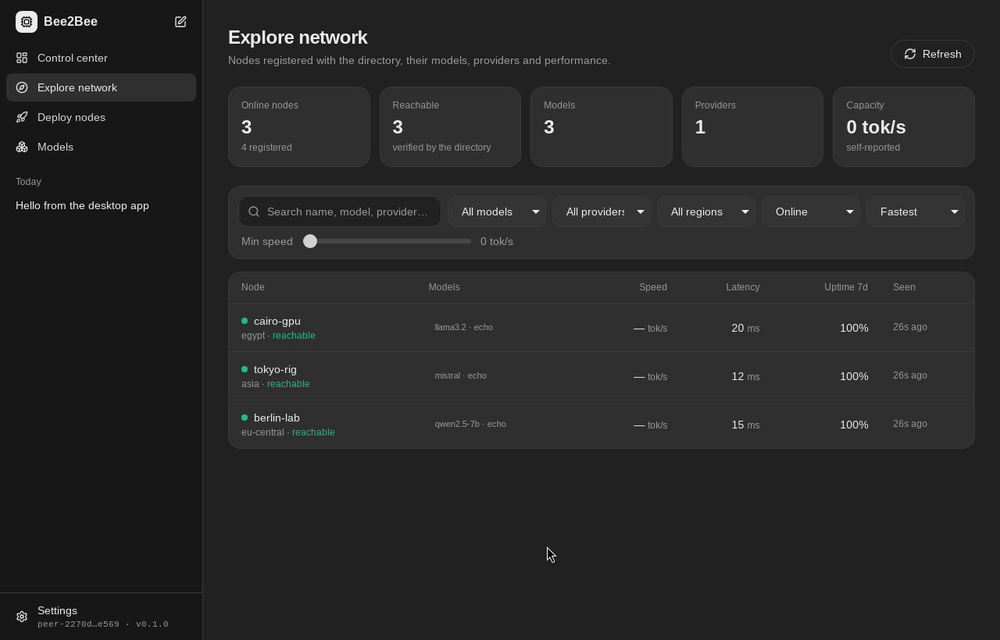
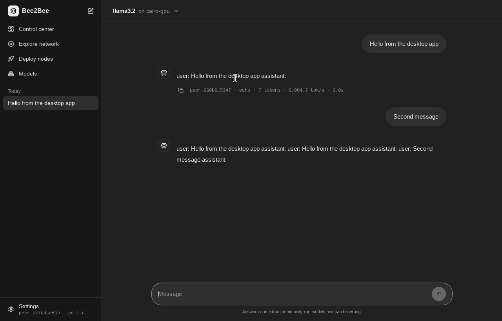
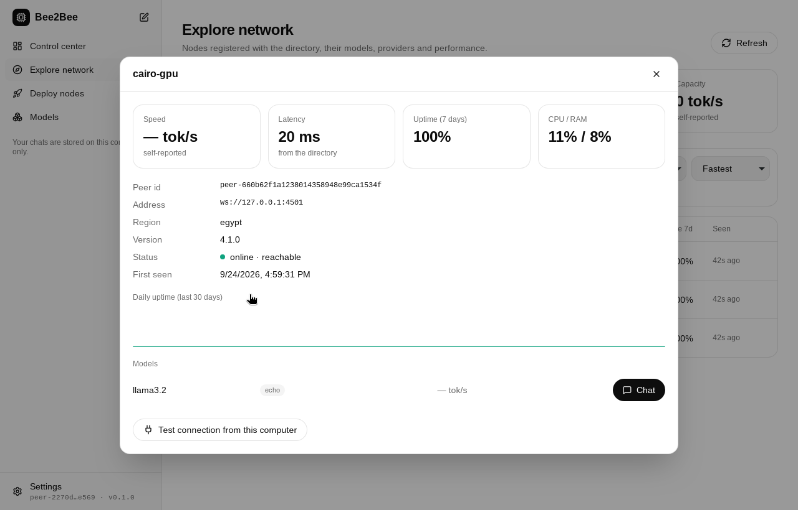
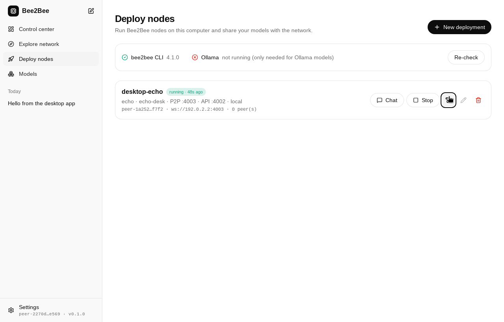

# Bee2Bee Desktop

Control center for the Bee2Bee mesh, built with **Tauri 2 + React + TypeScript**. The layout follows
ChatGPT: conversations in the sidebar, the chat in the middle, a model/node picker at the top.

| Page | What it does |
|---|---|
| Chat | Talk to **any** node: pick one from the network directory, one of your own deployments, or connect by address. The app verifies the node's Ed25519 identity, streams the answer, and shows which node answered with tokens, speed and latency. Stop and regenerate supported. Chats are stored on this computer only. |
| Control center | Network totals, your running nodes, top models, recent chats, your client identity. |
| Explore network | Search and filter nodes by name, model, provider, region, status, minimum speed; sort by speed, latency, uptime. Node details show uptime history, models and a "test connection from this computer" check. |
| Deploy nodes | Run `bee2bee serve-*` processes (Ollama, Hugging Face local, Hugging Face Inference API, echo), with live logs, start/stop, auto-start, local status (peer id, peers). Checks that the CLI and Ollama are available and can install `bee2bee` with pip. |
| Models | List, pull (with progress) and delete Ollama models; serve one with a click; serve Hugging Face models; see what is popular on the network. |
| Settings | Directory URL, CLI/Python commands, Ollama address, chat defaults, theme. |



| Chat (dark theme) | Node details | Deploy nodes |
|---|---|---|
|  |  |  |

Screenshots are from the real app on Linux, talking to a local directory server and live nodes.

## Architecture

```
src/                React UI (pages, components, lib)
src-tauri/          Tauri shell: commands exposed to the UI (src/lib.rs)
src-tauri/core/     bee2bee-core crate, no GUI dependency:
  identity.rs       Ed25519 identity + canonical JSON (byte-compatible with the Python node)
  protocol.rs       v2 handshake (hello / auth)
  mesh.rs           probe a node, stream chat completions, cancel
  deploy.rs         local node processes, logs, persisted configs
  ollama.rs         Ollama list / pull / delete
```

Nodes started by the app stop with it: on window close and on SIGTERM/SIGINT/SIGHUP the app stops
them gracefully; on Linux each node also gets `PR_SET_PDEATHSIG`, and on Windows nodes run in a
kill-on-close job object, so they do not survive even a hard kill of the app.

Secrets: the Hugging Face token is kept in memory only; each deployment gets its own node identity
under the app data folder; the app's client identity (`identity.pem`) never leaves the machine.

## Develop

Prerequisites: Node.js 20+, Rust stable, and on Linux `libwebkit2gtk-4.1-dev libgtk-3-dev
libayatana-appindicator3-dev librsvg2-dev libsoup-3.0-dev`.

```bash
npm ci
npm run tauri dev                 # app with hot reload
npm run lint && npm run typecheck && npm test
cd src-tauri && cargo test --workspace    # set BEE2BEE_PYTHON to run the interop test against a real node
npm run tauri build               # installers in src-tauri/target/release/bundle
```

## Release

Bump the version in `package.json` and `src-tauri/Cargo.toml`, commit, and push a tag `desktop-vX.Y.Z`.
The `Desktop app` workflow verifies everything and publishes installers for Windows, macOS (Intel and
Apple Silicon) and Linux to a GitHub release.
