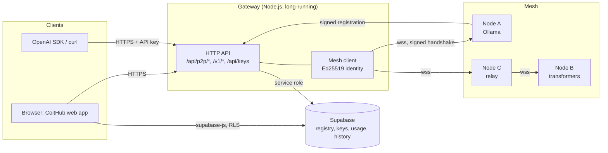

# Architecture

## Components

**Node (`bee2bee/`)**. A long-running Python process (`P2PNode`) with:

- a WebSocket server for peers (`p2p_runtime.py`) implementing the [v2 protocol](PROTOCOL.md);
- inference backends (`services.py`) with one async streaming interface: Ollama (httpx), local
  transformers (threaded, cancellable), Hugging Face Inference API, and an echo backend for tests;
- a FastAPI HTTP API (`api.py`): chat/NDJSON, OpenAI-compatible endpoints, health, metrics;
- a maintenance loop: pings, dead-peer eviction, reconnection with exponential backoff, peer discovery
  and signed registry sync.

**Gateway (`gateway/`)**. The public entry point. It keeps authenticated connections to up to
`MAX_NODE_CONNECTIONS` nodes, chooses a node per request (models, reputation, latency), fails over
before the first token, and cancels generations when clients disconnect. It is the only component
holding the Supabase service-role key. It verifies node registrations (signature, replay protection
and a connect-back probe that checks the address really belongs to that peer id).

**Web app (`app/`)**. A static React SPA. It talks only to the gateway. Signed-in users read and write
their chat history directly in Supabase, protected by row-level security.

**Database (`supabase/`)**. `active_nodes` (public read of verified, fresh nodes; no client writes),
`api_keys` (hashes only, never readable by clients), `usage_events`, `conversations`, `messages`,
`profiles`, and the aggregate `system_stats` view.

## Request flow (web chat)

1. The browser POSTs messages to `/api/p2p/generate`.
2. The gateway validates and clamps the request, applies rate limits (stricter for anonymous users),
   and picks candidate nodes.
3. It sends `gen_request` to the first candidate; if that node errors before streaming anything, the
   next candidate is tried (up to 3).
4. The node runs the model locally or relays to a peer that serves it (hop limit 3).
5. `gen_chunk` messages are streamed to the browser as NDJSON; `gen_done` carries real token usage.
6. The gateway records usage (per user or API key) and updates node reputation.

## Trust model

- Node identity is cryptographic; addresses are not trusted until a handshake proves who serves them.
- Nodes see the prompts they process. The product says so plainly and tells users not to send
  sensitive data. There is no end-to-end encryption between users and nodes.
- Node output is not verified. Reputation reflects availability and errors, not answer quality.
- The per-peer rate limit protects nodes from floods; a node that serves a gateway should list the
  gateway's peer id (from `GET /readyz`) in `BEE2BEE_TRUSTED_PEERS`, because the gateway multiplexes
  many users over one connection. The concurrency cap still applies.

## Measured capacity

With the echo backend (no model; this measures pipeline overhead only), one gateway container plus one
node container on a single host handled **~500–600 requests/s** with p95 ≈ 50 ms at 20 concurrent
clients and ≈ 200 ms at 100, with zero errors over 7,000 requests (`loadtest/quick.mjs`). Real capacity
is bounded by model speed and `BEE2BEE_MAX_CONCURRENT_GENERATIONS` on each node.
